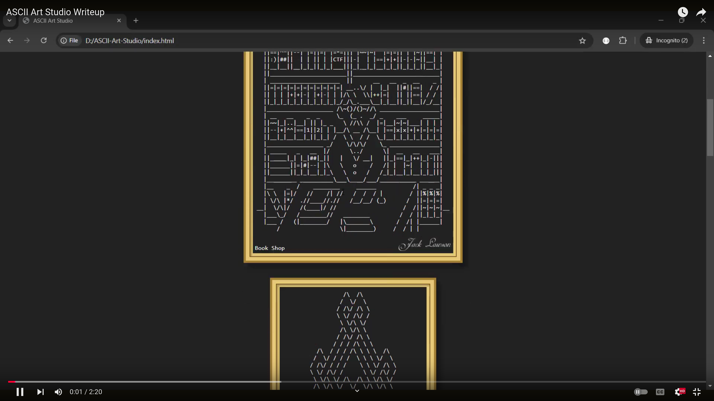
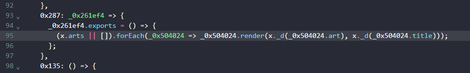
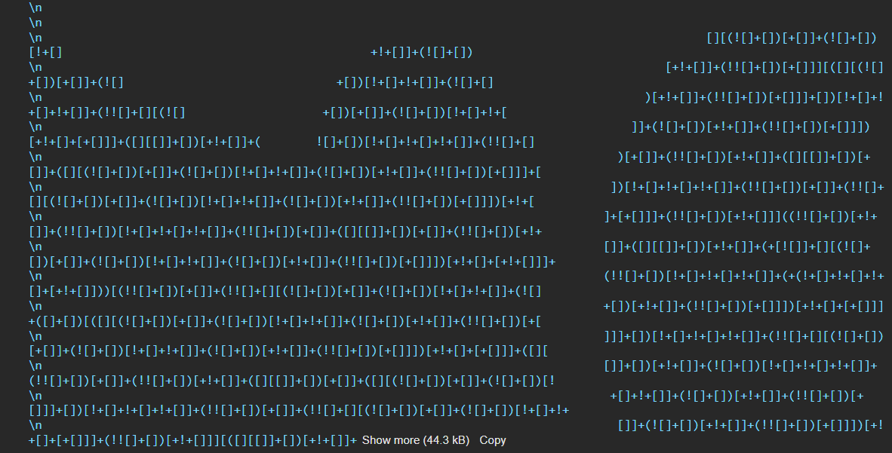
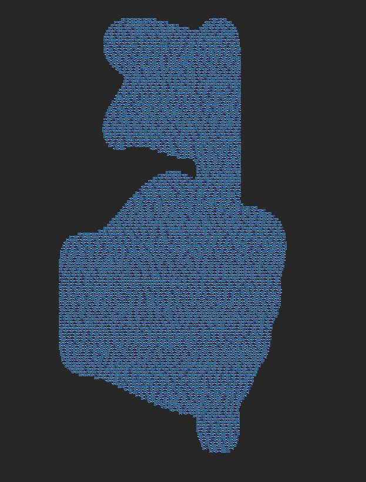

# ASCII Art Studio

**Jack Lawson, a master of ASCII art, invites you into his enigmatic studio. As you explore, you'll be surrounded by a collection of his intricate works. But beware—Jack has a penchant for concealing secrets within his creations. His most guarded pieces aren't on display for the public eye.**

**Your task is to uncover these hidden masterpieces, for within them lies the key to unlocking the flag. Begin your journey here: https://ascci-art-studio.uctf.ir/. The truth is waiting to be discovered.**

## Video Write Up

[](https://www.youtube.com/watch?v=fg0e4C4-OxI)

## Write Up

If you view the source code of the `index.html` file, you'll see that everythig is handled in a javascript file called `bundle.js`.

If you open the `bundle.js` file, you see that the code is obfuscated. So you have to deobfuscate the code first.

Hint: deobfuscate the code with [This](https://obf-io.deobfuscate.io/) website. 

```js
(() => {
  var _0x590317 = {
    0x263: () => {
      x.arts.push({
        'art': "%7BurP%3C%03%0D_iR%5D%05:%01%09Wj%05%...
```
So we find out that arts are stored in `x.arts`. 

Notice:
- `x.arts` length is `7` but only `6` arts are shown publicly. so one art is hidden.
- `x.arts` data is encrypted.

In `x.arts`, every object has the following props: `art`, `title`, `render`.

So We have to find out how does the render function work. let's find it's usage in the code:



Wow, both `title` and `art` props are passed to `x._d`. after checking it out we figure out that it is used for the decryption.

how to test? by runing this code in the browser console: 

```js
x._d(x.arts[0].art)
```

Then let's find out which article is hidden. lets print the titles of the paintings to see which one is not rendered:

```js
x.arts.map(art => x._d(art.title))
// Result:
[
    "Book Shop",
    "Unsolvable Maze",
    "Eagle",
    "Bug Fighter",
    "My Secret art",  // <=== secret art
    "Garfield",
    "Sonic"
]
```
The target art is at the index `4`.
let check the art itself: 

```js
x._d(x.arts[4].art)
```
Result will be a large ascii art:
Result:

Zoomed out: 


This is obviously a `jsfuck` code. So it is executable like a normal js code.

let's execute it with js `eval`:
```js
eval(x._d(x.arts[4].art))
```

Execution result: 

```js
'Hint: ..- -.-. - ..-. -.--. .-. .. --. -....- . -....- .--- . -. -. -.--.-'
```

Hmmm, morse code:

Translation: 
```
UCTF(RIG-E-JENN)
```

# Flag
```
UCTF(RIG-E-JENN)
```

# Categories

Check the categories which the challenge belongs to.

- [x] Web
- [ ] Reverse
- [ ] PWN
- [ ] Misc
- [ ] Forensics
- [ ] Cryptography
- [ ] Blockchain
- [ ] Steganography
- [ ] AI
- [ ] Data Science

# Points

| Warm up | This Challenge  | Evil |
| ------- |:---------------:| ----:|
| 25      |       400       |  500 |

# Resources

Every thing is inside of the `question` directory. It can be deployed just by a simple static web server. `index.html` is the index file.
