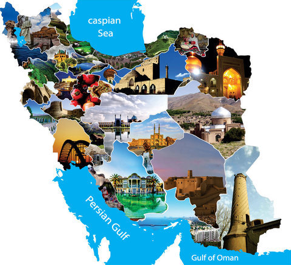

# Catch Me If You Can!

In the bustling bazaars of ancient Persia, where merchants traded silk and spices, a secret message has been intercepted. Legend has it that this message holds the key to discovering the whereabouts of a hidden treasure deep within the ancient city of Persepolis. However, the message has been cunningly encrypted and is hidden within a sea of network traffic. Can you decode it before the secret slips through your fingers?



# Write Up

To solve this challenge, follow these steps:

1. **Analyze the Network Capture**: Open the `capture.zip` file, extract it, and load the `.pcap` file into Wireshark or any other packet analysis tool. Begin by filtering the HTTP traffic.

2. **Extract the Hidden File**: Among the HTTP packets, locate and extract the `.html` file. Save it to your local machine.

3. **Decode the Hexadecimal Content**: The `.html` file contains a large block of hexadecimal code. Use the command line to convert this hex code into an image:
   ```bash
   xxd -r -p file.hex output_image.png
   ```
   Alternatively, online tools can be used for this conversion. Upon successful conversion, you'll see an image of a Caesar salad.

4. **Decrypt the Hidden Message**: The image isn’t just a picture; it’s a clue! It hints that the encrypted message is using the Caesar cipher. Apply a Caesar cipher decryption with a shift of 4 to reveal the hidden message and uncover the flag.


# Flag

```
UCTF{Tabriz_Grand_Bazaar}
```

# Categories

Check the categories which the challenge belongs to.

- [ ] Web
- [ ] Reverse
- [ ] PWN
- [x] Misc
- [x] Forensics
- [x] Cryptography
- [ ] Blockchain
- [ ] Steganography
- [ ] AI
- [ ] Data Science

# Points

| Warm up | This Challenge  | Evil |
| ------- |:---------------:| ----:|
| 25      |      350        | 500  |
