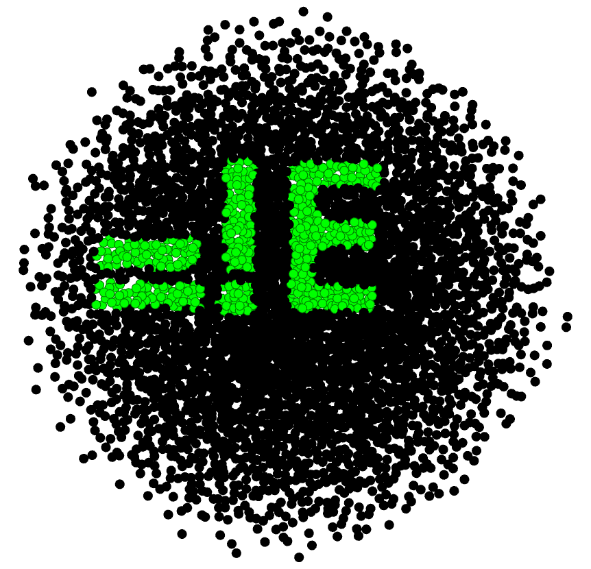

# Graphical Giggles: The Hidden Message

Welcome to the wacky world of graph mysteries! 🕵️‍♂️ In this challenge, you’ll be diving into a graph created with Gephi version 0.10.1. Some nodes in this graph are a bit different that makes them stand out. Your mission, should you choose to accept it, is to use a certain layout algorithm with the following parameters:

* seed: -6166447964882867254
* iterations: 200.

If you do everything right, you’ll uncover a hidden 3-character text that will make you go “Aha!” Good luck, and may the graph be with you!

Hint: To get the final flag, compute the MD5 hash of the revealed 3-character text. Good luck, and may the graph be with you!

# Write Up

To solve this challenge, follow these steps:

1. Open the provided graph in Gephi version 0.10.1.
2. Run the OpenOrd layout algorithm with the parameters: seed: -6166447964882867254 and iterations: 200.
3. Filter the nodes that have the "color" attribute of "sp**e**cial" (not sp**a**cial) in the Data Laboratory Tab in Gephi.
4. Change the color property of these nodes to an easily-visible color like green.
5. Increase the size of all of the nodes to a high number like 100.
6. Observe the graph to read the 3-character text that becomes visible when the nodes are positioned correctly.
7. Compute the MD5 hash of the revealed 3-character text. The flag is the MD5 hash enclosed in `UCTF{}`.

# Flag

The 3-character Flag is `=!E`. To get the final flag, compute the MD5 hash of this text. The flag is `UCTF{0491c45315cb68f2f3ce5389d47888c8}`.

# Categories

Check the categories which the challenge belongs to.

- [ ] Web
- [ ] Reverse
- [ ] PWN
- [ ] Misc
- [ ] Forensics
- [ ] Cryptography
- [ ] Blockchain
- [x] Steganography
- [ ] AI
- [ ] Data Science

# Points

| Warm up | This Challenge  | Evil |
| ------- |:---------------:| ----:|
|   25    |       350       | 500  |
