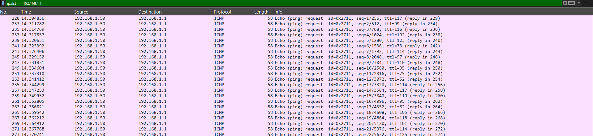
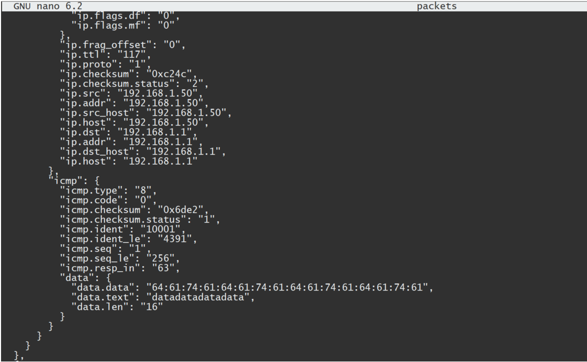
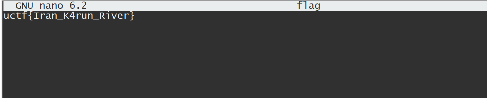

# Hidden Coordinates

Jack Sparrow may be searching for treasure, but he’ll never find the map if he can't decipher the signals. Buried within a seemingly ordinary pcap file are hidden details encoded in ICMP packets. Unearth the secrets concealed in these packets to reveal the flag.

# Write Up

In this challenge, you're provided with a pcap file containing ICMP packets. The initial observation reveals that these packets are sent to two distinct destinations. Hidden within these packets is crucial information.

Inspecting the ICMP packets shows that while the payloads appear unremarkable, the TTL values in ICMP Request packets directed at 192.168.1.1 exhibit irregularities, unlike the consistent TTL values in their Replies. 

These TTL values likely encode ASCII characters. To decode them, follow these steps:

1. Filter the packets destined for 192.168.1.1 in Wireshark using the filter `ip.dst == 192.168.1.1`.

   

2. Mark and export these packets as JSON.

   

3. Extract and decode the TTL values using the following command:

   ```
   cat packets | grep 'ttl' | cut -d ":" -f2 | cut -d '"' -f2 | awk '{printf("%c",$1)}' > flag
   ```

4. Open the `flag` file to reveal the flag.

   

# Flag
```
uctf{Iran_K4run_River}
```

# Categories

- [x] Web
- [ ] Reverse
- [ ] PWN
- [x] Misc
- [x] Forensics
- [ ] Cryptography
- [ ] Blockchain
- [ ] Steganography
- [ ] AI
- [ ] Data Science

# Points

| Warm up | This Challenge  | Evil |
| ------- |:---------------:| ----:|
| 25      |       150       | 500  |

# Resources

The file `plan.pcap` is all you need.
