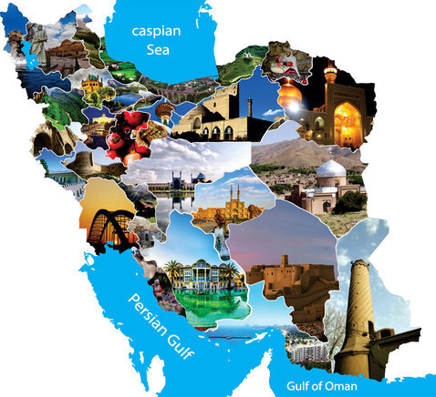

# Karaball

Legend whispers of cryptic secrets hidden deep within the ancient Tabriz Saat Tower clock. The messages have eluded seekers for centuries. Will you be the one to finally uncover them? Begin your journey by exploring [http://karaball.uctf.ir](http://karaball.uctf.ir) on port 80. The tower awaits.



# Write Up

The challenge is about Eliptic Curve Cryptography especially related to [CurveBall](https://www.the20.com/blog/cve-2020-0601/) vulnerability which was a cryptography vulnerability in Miscosoft CryptoAPI.

The security issue is where the signature verification section accepts custom generator on the curve. here the attacker can choose the generator as Q which is the signature of the host name which he wants to spoof. by choosing `G=Q` and `d=1` which is the private key, the attacker would be successful of generating a valid signature and bypassing verification process.

But this issue is patched by this condition
```py
if d1 < 2:
    conn.sendall(b"Security Issues Discovered!\r\n")
    break
```

so the challenge would get a little bit tougher. the idea is to instead of choosing `G=Q` and `d=1` the participants ca choose `d=order of G + 1` which will reach the point `Q` again without requiring to choose `d=1`. this is because of group's order behaviour. In an abelian group the order of an element is the least possible value `n` which `n*G=O` and `O` is the identity element which in case of ecc group it is the point at infinity. so if we choose `d=order of G + 1` the equations would be like this

```
G = Q => valid signature
d = n*G
n = G_Order + 1
Q' = (G_order + 1) * Q
Q' = G_order*Q + Q
Q' = O + Q
Q' = Q 
```

so we generated a valid signature without requiring to choose `d=1` or even `d=-1` and `G = Q(x,-y)` which would still generate a valid signature.

Here is generation of valid signature


then


# Flag

```
uctf{TuRn_4r0unD_On_r3gu14r_0rd3r_l1k3_TABRIZ_S4at_7oWeR_cl0cK}
```

# Categories

- [ ] Web
- [ ] Reverse
- [ ] PWN
- [ ] Misc
- [ ] Forensics
- [x] Cryptography
- [ ] Blockchain
- [ ] Steganography
- [ ] AI
- [ ] Data Science

# Points

| Warm up | This Challenge  | Evil |
| ------- |:---------------:| ----:|
| 25      |       500       | 500  |

# Deployment

```bash
cd Deployment_On_Server
docker-compose build
docker-compose up
```
