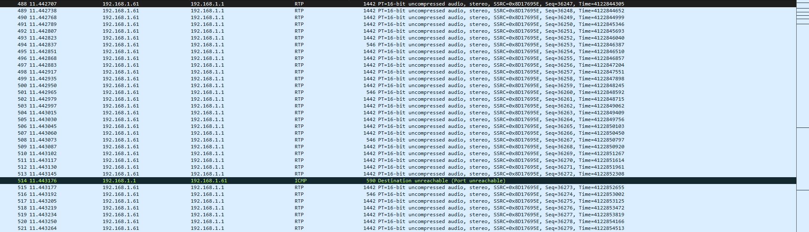
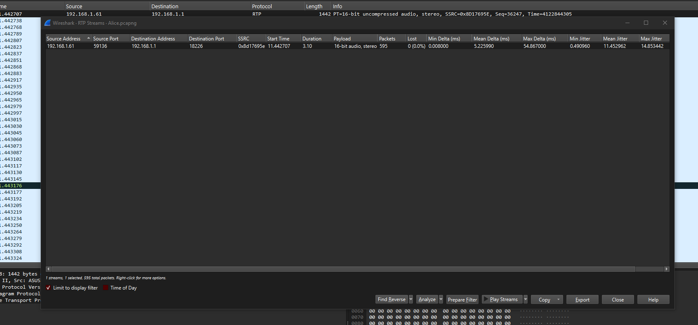
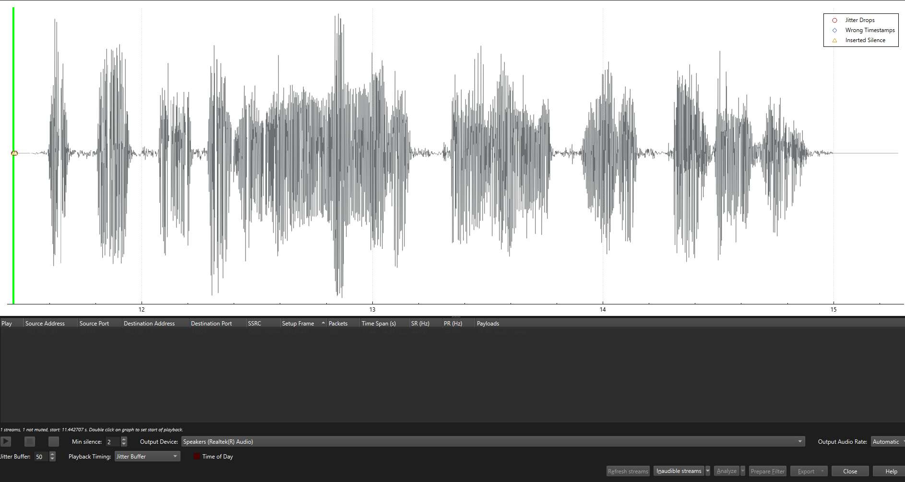

# Lost Voyage

**Curse those pirates! I should've taken better precautions to hide my travel plans. The secret is now out there, but it's still within reach—if you know where to look. Remember, the answer lies within uctf{}...**

# Write Up

In this question, a pcap file is provided to the user, and it is inferred from the title that a data leak has occurred. Upon examining this file, we find that there are several unencrypted RTP packets. RTP is a network protocol used for transmitting audio and video over IP networks.




Therefore, based on these indicators and the question's title, it can be inferred that some information might be hidden within these packets. In Wireshark, there is a feature to play RTP streams. By navigating to that section, we can access the stream present in this file and replay it.






By playing this stream, you can hear the secret for this level, and by placing it inside uctf{}, you will obtain the flag.

# Flag

```
uctf{iran_lut_desert}
```

# Categories

- [ ] Web
- [ ] Reverse
- [ ] PWN
- [X] Misc
- [ ] Forensics
- [ ] Cryptography
- [ ] Blockchain
- [ ] Steganography
- [ ] AI
- [ ] Data Science

# Points

| Warm up | This Challenge  | Evil |
| ------- |:---------------:| ----:|
| 25      |       150       | 500  |

# Resources

The file Alice.pcap is all you need.
