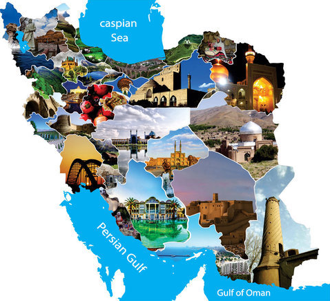

# Modal 2

The path to uncovering the secret is tangled in numbers—only the sharpest minds will find clarity.



# Write Up

This challenge involves solving a simple modular arithmetic equation. The encryption formula is:

```
c = (m * a + b) % p
```

To retrieve `m` from `c`, rearrange the equation as:

```
m = (c - b) * (a^-1) % p
```

Where `a^-1` is the modular multiplicative inverse of `a` modulo `p`.

Here’s the solution code:

```py
enc = [678296017,867140740,2721963345,2868842574,615347776,1035002716,2847859827,1391709415,2784911586,636330523,909106234,2763928839,1223847439,699278764,1223847439,2742946092,825175246,3393411249,2889825321,3393411249,1370726668,594365029,]

flag = ''
p = 4066351909

for e in enc:
    t = ((e + 127389238) * pow(2022684581, -1, p)) % p
    flag += chr(t)

print(flag)
```

# Flag

```
uctf{Sh1ny_pAsArg4d43}
```

# Categories

- [ ] Web
- [ ] Reverse
- [ ] PWN
- [ ] Misc
- [ ] Forensics
- [X] Cryptography
- [ ] Blockchain
- [ ] Steganography
- [ ] AI
- [ ] Data Science

# Points

| Warm up | This Challenge  | Evil |
| ------- |:---------------:| ----:|
| 25      |        200      | 500  |
