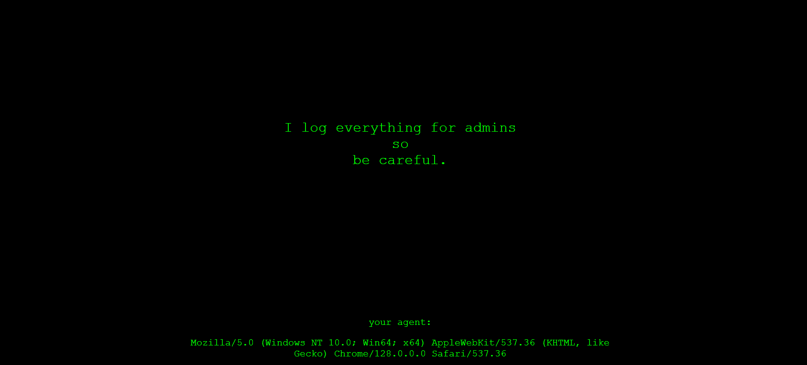
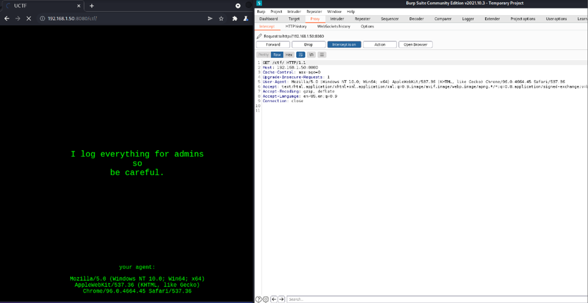
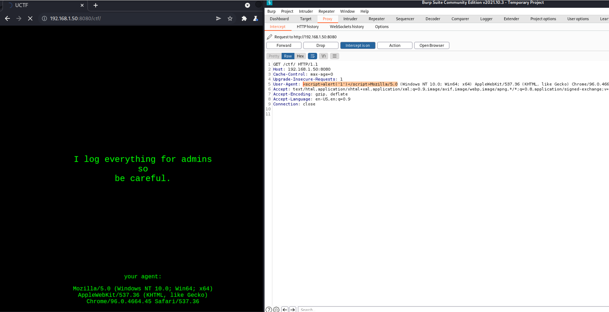
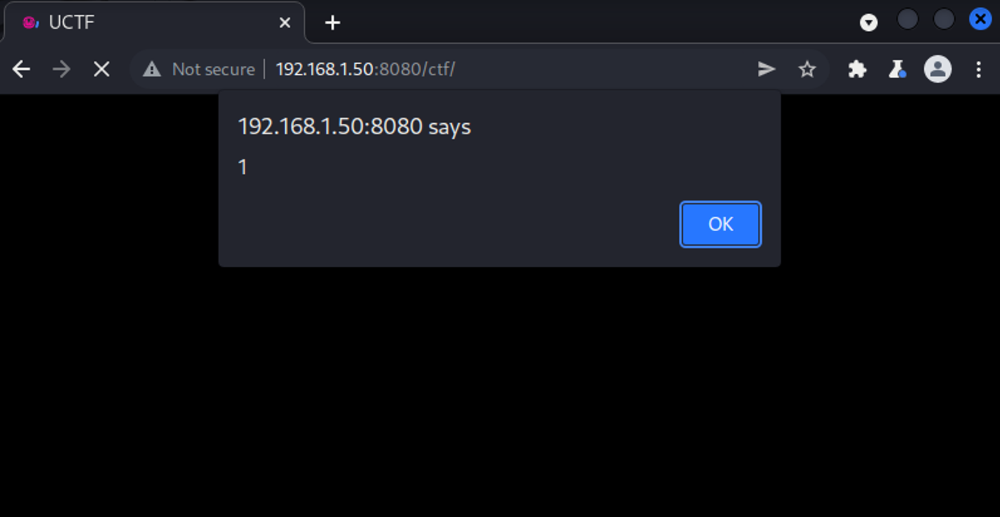
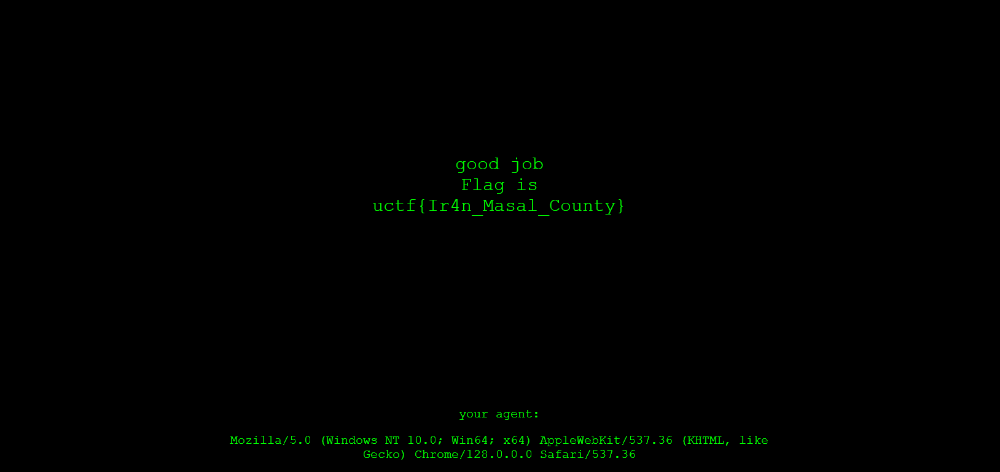

# Silent Watcher

Beware, pirates. Every step you take is being carefully logged. Your actions are under constant surveillance, and your next move might reveal more than you intend. Start your investigation from [here](https://simple.uctf.ir/), but tread carefully.

# Write Up

In this question, the user encounters a page that informs them that everything is being logged for the administrators, and the browser's user-agent is also displayed. This suggests that the site admin might have a dashboard for monitoring visitor information.



Given that all visitor information is being logged, it can be inferred that an attack should be carried out through the data being sent. Since the visitor's user-agent is visible on this page, it is likely that this is one of the important pieces of information the admins are interested in storing and reviewing. Therefore, it is necessary to investigate whether a successful XSS attack can be carried out against this site via the user-agent.



This can be done using Burp Suite or any other tool that allows you to modify HTTP headers. In this case, we will use Burp Suite to check whether the user-agent is vulnerable. To do this, we will insert an XSS payload into the user-agent.



In the response, we encounter the following page, indicating that it is vulnerable.



And then, by confirming this pop-up, the following page is displayed.



# Flag

```
uctf{Ir4n_Masal_County}
```

# Categories

- [X] Web
- [ ] Reverse
- [ ] PWN
- [ ] Misc
- [ ] Forensics
- [ ] Cryptography
- [ ] Blockchain
- [ ] Steganography
- [ ] AI
- [ ] Data Science

# Points

| Warm up | This Challenge  | Evil |
| ------- |:---------------:| ----:|
| 25      |       150       | 500  |

# Resources

The file index.php and type.mp3 files in the question folder should be placed on a web server.
