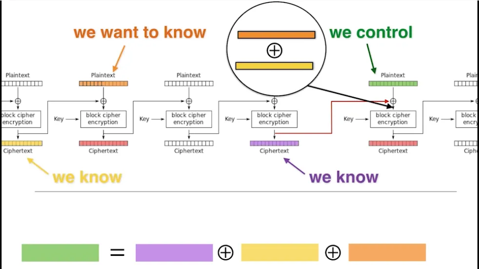

# The Prophecy

Sibyl the legendary persian prophetic priestess is prophesying the flag! Yet you cannot understand her cryptic way of speaking. You can communicate with her by sending a get request to `https://dalma.uctf.ir/?password=deadbeef` where `deadbeef` is a hex number representing the password to understand what she says. If you get the password right, you might understand her and find the flag. If you get the password wrong however, she tries to tell you the password by concatenating the hex number you sent  and the actual correct password (in order) and sending the result to you. Yet the tongue of the oracles are cryptic and thus anything she says is encrypted!

There is still hope however! You know that she uses cookies to assign a (cryptographically) random initialization vector for each person she speaks to. Maybe you can use it to understand her prophesy?!

## Hints

 * Hint 1 (50 point penalty): She uses [Cipher Block Chaining](https://en.wikipedia.org/wiki/Block_cipher_mode_of_operation) mode to encrypt the data.
 * Hint 2 (50 point penalty): Use the session she keeps to guess the initialization vector.
 * Hint 3 (100 point penalty): Use an attack similar to [BEAST](https://medium.com/@c0D3M/beast-attack-explained-f272acd7996e).

# Write Up

Since the encryption is using the CBC mode, in a single session the last encrypted block is used as IV to encrypt the next request. We should use an attack like [BEAST](https://medium.com/@c0D3M/beast-attack-explained-f272acd7996e) to compare the IV (last encrypted block) XOR a know ciphertext block XOR our guess of the correct next block plaintext. However bruteforcing the last one takes a lot of time. Hence we use the length of the password we send as padding to push the actual encrypted password to the next block except it's first byte. Hence we guess the first byte with only 2^8 = 256 tries. Next we remove a byte of padding to guess the second byte of the password, and so on until we can login with the password and get the flag. An implementation is provided in the `writeup.py` file.

# Flag

`uctf{b3h157un}`

# Categories

Check the categories which the challenge belongs to.

- [x] Web
- [ ] Reverse
- [ ] PWN
- [ ] Misc
- [ ] Forensics
- [x] Cryptography
- [ ] Steganography

# Points

| Warm up | This Challenge  | Evil |
| ------- |:---------------:| ----:|
| 25      |       450       | 500  |
