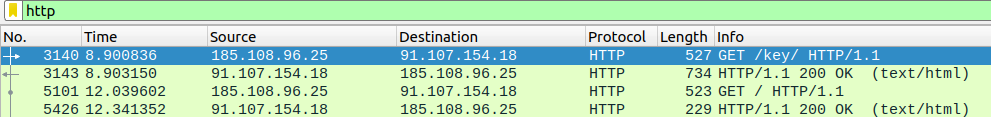
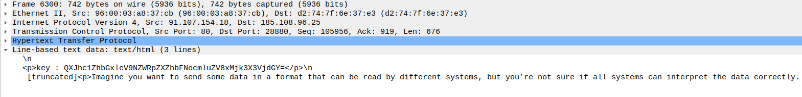
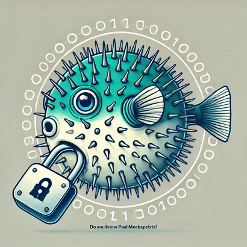
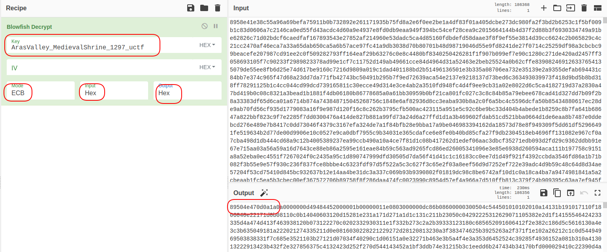
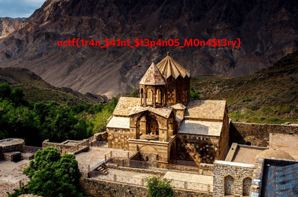

# The Road of Redemption 

The key to redemption lies in the hands of those who know the deep secrets of the church. Do you have the courage to uncover them and find your way to the light?


# Write Up

With a brief glance at the requests, it can be understood that there are two HTTP requests containing HTML data.



One of them points to the key directory. Upon opening it, you encounter an encrypted text and a message. By examining the message text, you can know that the Base64 protocol has been used.



If you decode this ciphertext using the Base64 protocol, you will obtain the following key:
ArasValley_MedievalShrine_1297_uctf

Now, if we look at the content of the second HTTP request, we notice that it is a hex file. By looking at the beginning of it—89 50 4E 47 0D 0A 1A 0A—we can determine that this is a PNG file.

I extracted its data and used an online website to convert it into a PNG image, resulting in the image below.

you can use "https://capitalizemytitle.com/hex-to-image-converter/" to convert hex to png



Based on the image, we can determine that Blowfish encryption was used. Additionally, the text notes that Paul Mockapetris is the person who introduced the DNS protocol, so the DNS packets should be examined.

To save the addresses of all DNS requests sent to uctf.ir into a text file, you can use the following command:

```bash
tshark -r The-Road-of-Redemption.pcap -Y "dns.qry.name contains uctf.ir" -T fields -e dns.qry.name > dnsrecords.txt
```
To remove duplicate domain addresses from the text file, where each address appears twice (once for the request and once for the response), you can use the following command:
```bash
uniq < dnsrecords.txt > uniqrecords.txt
```
To filter out the .uctf.ir domains and retain only the subdomains, followed by concatenating the remaining data into a single hex file, you can use the following commands:
```bash
sed 's/.uctf.ir//g' uniqrecords.txt > subdomains.txt
```
```bash
tr -d '\n' < subdomains.txt > hexfile.txt
```

The obtained hex data is decrypted using any tool (I used icyberchef.com) and the key from the first HTTP file to produce the new hex data.



By examining the new hex data, we can see that it is also a PNG image. Converting the hex data back into an image reveals the flag.



# Flag

```
uctf{1r4n_$41nt_$t3p4n05_M0n4$t3ry}

```

# Categories

Check the categories which the challenge belongs to.

- [ ] Web
- [ ] Reverse
- [ ] PWN
- [X] Misc
- [X] Forensics
- [ ] Cryptography
- [ ] Blockchain
- [ ] Steganography
- [ ] AI
- [ ] Data Science

# Points

| Warm up | This Challenge  | Evil |
| ------- |:---------------:| ----:|
|    25   |       250       | 500  |

# Resources

file : The-Road-of-Redemption.pcap
