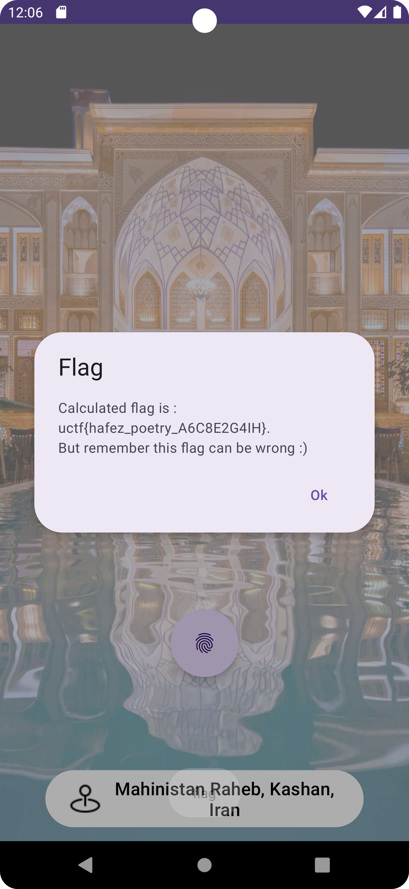

# Travel Guide
Embark on a digital journey to a hidden destination in Iran. Uncover the secrets within the app and find your way to the true path. Will you navigate the unknown, or remain lost forever?(Min android version : 9)

# Write Up
When start application in the first page of application there is button which user need to click to go to next activity.


When click on this button,an activity loaded which state that you travel to wrong place.


If you decompile apk with `jadx` and look for UnknownActivity you see that, there is nothing exists in this activity so

we focus on launcher activity which is WorldActivity.


In this activity when flight button clicked , it tries to launch IranActivity but as we see in the application it launches unknown activity.

If we pay attention to manifest again, we see that there is appcomponentfactory attribute in application tag which has

`com.uuctf.travelmanager.Meta` value so it may the place this changes happen.


After we open `com.uuctf.travelmanager.Meta` class in jadx, we see that in `instantiateActivity` method it check that 

when an activity contain `Iran`, it return UnknownActivity, so we find the cause.


For solving this issue we have muliple ways, we can decompile the apk with `apktool` and delete this part of smali code or

we can use frida to hook this method.We go with second approach.

For hooking this method we write a js script like following which hook `instantiateActivity` and check if the activity class name

is equalls with iran activity then make an instance of this activity and return it.


Then we need to run app with following shell command using adb:


Now when we press on flight button we go to iran Activity.


In this activity user asked to enter account id and there is only on button which when clicked a timer appear and 

after 5 seconds it disappear.

Looking for source code of this button click shows that when we press this button shortly it adds zero to array and one when 

press for long time.So it seems that it's a morse code.


Now if look carefully we see that we have timer which implemented by `CountDownTimer` and at finish stage it check entered morse code

with native method called `CheckCode`.


So we should have a so file which this method should exists in it.There is travel so file so we are going to 

decompile it using `grida` to find the `CheckCode` and see can we find morse code.

After decompiling the so file we see that in some part of checkCode function it compare array values with global values 

like `DAT_000539ac` and if we look at .data part of decompiled code we see that these values asigned there.


We see that `codeArr` array asigned with hexadecimal values which if we convert them to decimal it 

should be `{0, 0, 1, 0, 1, 1, 0}`.So it seems that we find our morse code.

After Entering morse code we see that it shows a dialog which contains flag.

Remember in process of calculating flag , it uses apk signature, so if you decompile the apk and resign it you should hook the 

`getAppSignature` method using frida and return the main signature of apk.

You can get the main signature of apk by installing it in phone and retrieve the signature using another apk.




# Write Up Video
[Video link](https://s32.picofile.com/file/8479140626/TravelGuideSolution.mkv.html)

# Flag
```
uctf{hafez_poetry_A6C8E2G4IH}
```

# Categories
- [ ] Web
- [x] Reverse
- [ ] PWN
- [ ] Misc
- [ ] Forensics
- [ ] Cryptography
- [ ] Blockchain
- [ ] Steganography
- [ ] AI
- [ ] Data Science
 # Points

| Warm up | This Challenge  | Evil |
| ------- |:---------------:| ----:|
| 25      |       350       |  500 |


# Resources

Apk file exists in `files` folder.
