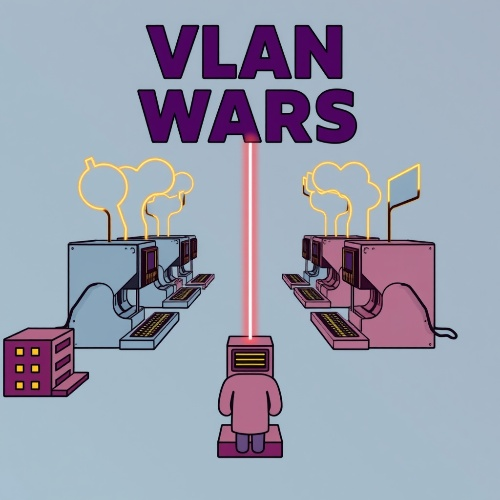
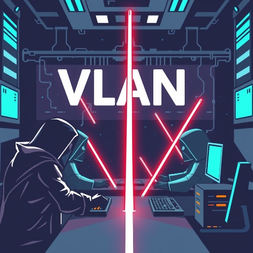

# VLAN Wars

Cisco VLAN Doesn't allow me to pass, Please help me!
Just connect to User-switch then take me in Root-switch. 

- **Download helper.pdf:** [PDF](https://mega.nz/file/2ckxwKIb#F7e_Npdb70m1pmfWgaTJvPbPW3rjX6wOYbAfEFnRnIU)
- **Downlaod Eve-ng:** [Eve-ng](https://mega.nz/file/yFUTFagK#DKzVkcmuJGsaukn6FfRMkcSMrBH-D46NvP1Zjo14cKU)



# Write Up

As you see we have access to User-Switch, first we should connect to User-Switch via *Telnet*. open cmd...

       1. telnet 192.168.100.100 "username:admin   password:admin"

       2. in this level we connected to the switch and just go *Enable-mode*. Write enable then press enter. "password:cisco"
         
       3. for know about switch configuration, can write *show running-config*
         


       4. in this section we have configuration of switch, all ethernet ports are in vlan 2, but to access root switch we need to enable vlan 10 and change ports' vlan.
                1 --> configure terminal
                2 --> interface range ethernet 0/0-1
                3 --> switchport access vlan 10 
                4 --> exit
                5 --> interface vlan 10
                6 --> no shutdown
                7 --> exit
                8 --> exit


       5. Connect to root-switch via telent.*Roor switch's IP, USERNAME, Passwords were written in one of ports' description."In User-Switch"*
                1 --> In enable-mode : telnet *Root-switch-IP*

       6. again go *Enable-mode* then write *show running-config*
         
       7. Now you can see flag!

# Flag

```
UCTF{A!@mut_C@sTl3}
```

# Categories

- [ ] Web
- [ ] Reverse
- [ ] PWN
- [ ] Misc
- [x] Forensics
- [ ] Cryptography
- [ ] Blockchain
- [ ] Steganography
- [ ] AI
- [ ] Data Science
- [x] Network

# Points

| Warm up | This Challenge  | Evil |
| ------- |:---------------:| ----:|
| 25      |       350       | 500  |
